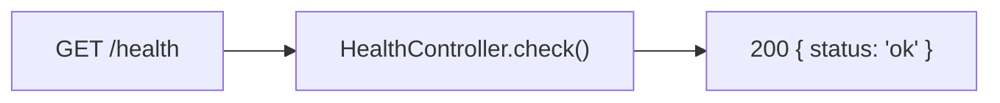
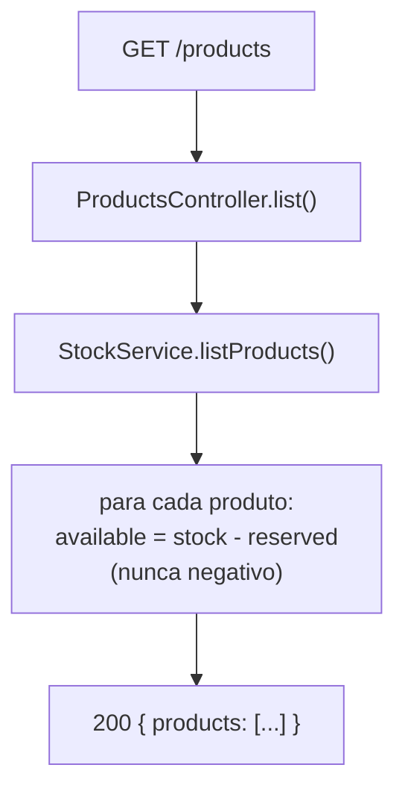
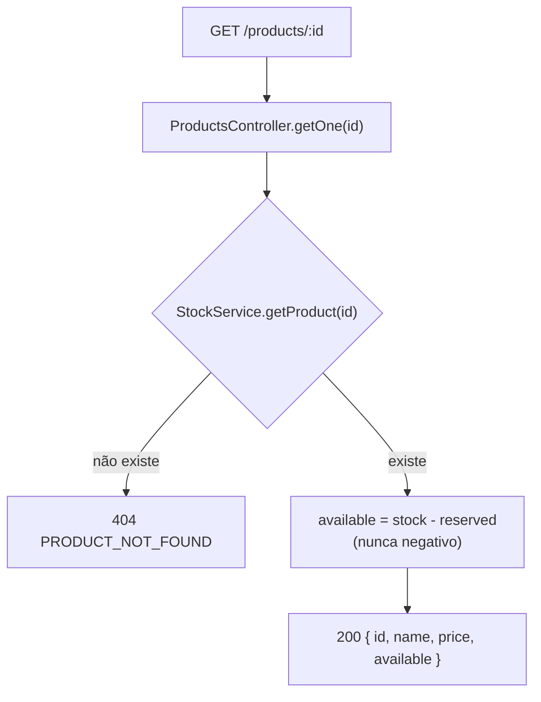
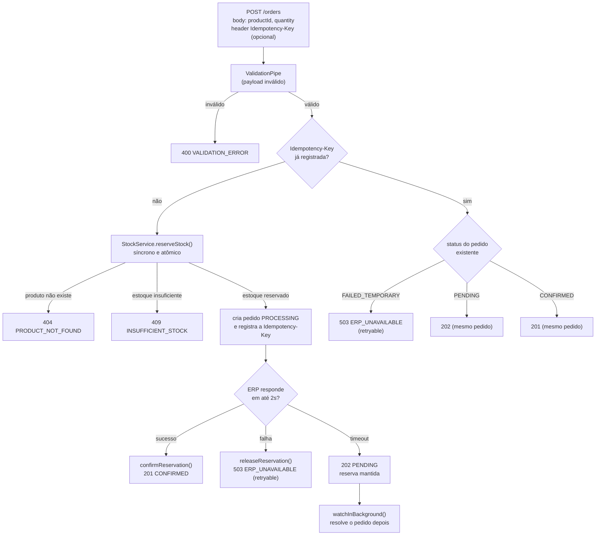
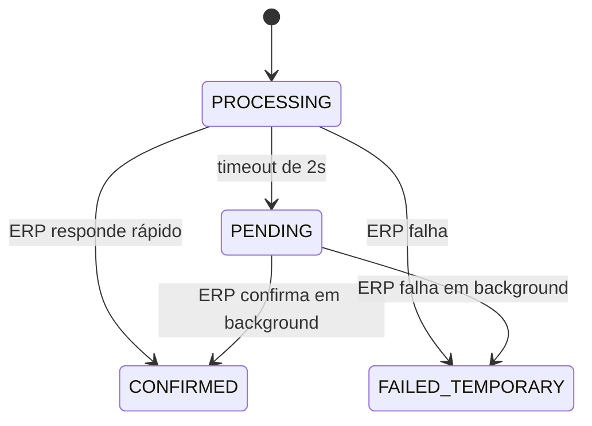
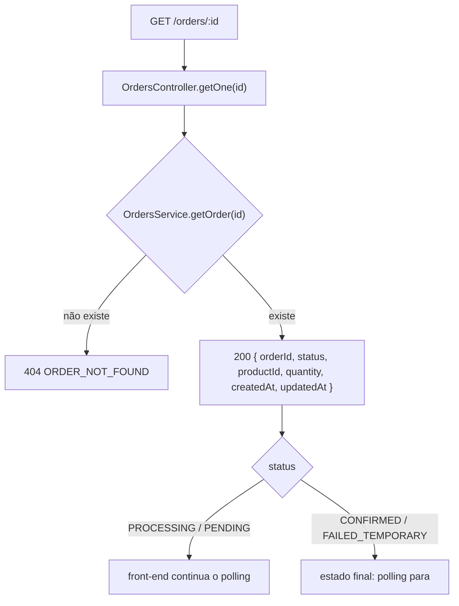

<p align="center">
  
</p>

# Backend — CaseCellShop Checkout API (NestJS)

API do fluxo de checkout, feita em **NestJS + TypeScript**, com dados em
memória, Swagger, logging estruturado e testes unitários + E2E.

## Como rodar

```bash
npm install

# desenvolvimento (recarrega automaticamente)
npm run start:dev

# build de produção
npm run build
npm start
```

A API sobe em `http://localhost:3001` (configurável via `PORT`).

- **Swagger (documentação interativa da API):** `http://localhost:3001/docs`
- **Healthcheck:** `GET /health`
- **Logs:** gravados em `backend/logs/app.log` (pasta fora de `src`/`dist`), com
  uma linha JSON por evento (`time`, `level`, `context`, `message`). Todo
  request HTTP passa pelo `LoggingInterceptor` e vira uma linha com
  `context: "HTTP"`; no console os mesmos logs saem em formato legível.

## Testes

```bash
npm test          # unitários (colocalizados como *.spec.ts, ex: stock.service.spec.ts)
npm run test:e2e  # end-to-end (test/app.e2e-spec.ts) - sobe a aplicação real via Supertest
```

## Estrutura

```
src/
├── main.ts                    bootstrap: Swagger, pipes, filtros e logger global
├── app.module.ts               módulo raiz + registro do interceptor de log das rotas
├── health.controller.ts        GET /health
├── bootstrap/                  configuração compartilhada entre main.ts e os testes e2e
│   ├── configure-app.ts         CORS, ValidationPipe e filtro global
│   └── swagger.ts                montagem da documentação em /docs
├── common/
│   ├── dto/                      contrato de erro usado na documentação do Swagger
│   ├── exceptions/               exceções de domínio (404/409/503 já formatadas)
│   ├── filters/                  filtro global que normaliza toda resposta de erro
│   ├── interceptors/              LoggingInterceptor: uma linha por request HTTP
│   └── service/custom-logger/     CustomLoggerService: console + logs/app.log
├── data/
│   └── products.seed.ts          catálogo inicial (Map novo a cada instância)
└── module/
    ├── stock/                     StockService: reserva/confirma/libera estoque (atômico)
    ├── erp/                        simulador do ERP (latência/instabilidade)
    ├── products/                   controller de catálogo
    └── orders/                     DTO, controller e service do checkout
test/
└── app.e2e-spec.ts             testes end-to-end (12 cenários)
```

## Fluxo de cada endpoint (diagramas)

Rotas expostas pela API:

| Método | Rota | Controller | O que faz |
| --- | --- | --- | --- |
| GET | `/health` | `health.controller.ts` | Healthcheck simples |
| GET | `/products` | `products/products.controller.ts` | Lista o catálogo com estoque disponível |
| GET | `/products/:id` | `products/products.controller.ts` | Consulta um produto específico |
| POST | `/orders` | `orders/orders.controller.ts` | Checkout: reserva estoque e fatura no ERP |
| GET | `/orders/:id` | `orders/orders.controller.ts` | Status do pedido (polling após um `202`) |

### `GET /health`



### `GET /products`



### `GET /products/:id`



### `POST /orders`



Estados possíveis do pedido (campo `status`), começando em `PROCESSING`:



### `GET /orders/:id`



Todos os erros dos diagramas saem no mesmo formato
`{ errorCode, message, retryable }`, garantido pelo filtro global em
`common/filters/http-exception.filter.ts`.

## O que esperamos observar na entrega — Backend

Checklist do desafio, com um detalhamento de **onde e como** cada item foi
resolvido (para você, no futuro, lembrar rápido o que foi feito e por quê).

- [x] **Existe uma API para listar ou consultar produtos.**
  `GET /products` e `GET /products/:id` em `products/products.controller.ts`,
  usando o `StockService` como fonte dos dados (estoque em memória).

- [x] **Existe uma API para criar uma tentativa de compra.**
  `POST /orders` em `orders/orders.controller.ts`, delegando a lógica para
  `orders/orders.service.ts`.

- [x] **A API valida entradas inválidas.**
  `orders/dto/create-order.dto.ts` usa decorators do `class-validator`
  (`@IsString`, `@IsInt`, `@Min`, `@Max`), aplicados globalmente pelo
  `ValidationPipe` configurado em `bootstrap/configure-app.ts` (com
  `whitelist` e `forbidNonWhitelisted`, ou seja, campos extras no payload
  também são rejeitados).

- [x] **A API diferencia sucesso, erro de validação, estoque insuficiente e
  falha técnica.**
  Cada caso vira uma exceção/HTTP status diferente:
  `common/exceptions/domain.exceptions.ts` define
  `ProductNotFoundException` (404), `InsufficientStockException` (409) e
  `ErpUnavailableException` (503, `retryable: true`); a validação de payload
  vira 400 automaticamente via `ValidationPipe`. O `common/filters/http-exception.filter.ts`
  garante que **todo** erro (esperado ou não) sai no mesmo formato
  `{ errorCode, message, retryable }`.

- [x] **A solução evita vender mais unidades do que o estoque disponível.**
  `stock/stock.service.ts` → `reserveStock()`: checagem e reserva em uma
  única função **síncrona** (sem `await` no meio), o que no Node.js garante
  atomicidade mesmo sob duas requisições concorrentes. Coberto por teste
  dedicado em `stock/stock.service.spec.ts` (reserva concorrente) e pelo
  teste E2E de concorrência em `test/app.e2e-spec.ts`.

- [x] **Há alguma estratégia simples contra pedido duplicado?**
  Header `Idempotency-Key` (ver `orders/orders.service.ts`): a chave é
  registrada no mesmo trecho síncrono da reserva de estoque, então duas
  requisições concorrentes com a mesma chave nunca reservam estoque duas
  vezes — a segunda encontra o pedido já criado pela primeira. Testado em
  `test/app.e2e-spec.ts` (seção "idempotência").

- [x] **Há uma simulação clara de processamento lento ou instável do ERP.**
  `erp/erp.service.ts`: 65% sucesso rápido, 20% sucesso lento (dispara o
  timeout do checkout), 15% falha transitória. O timeout do lado do
  checkout (2s) está em `orders/orders.service.ts` (`raceErp`).

**Bônus implementados:**
- Logs estruturados: `common/service/custom-logger/` (console + `logs/app.log`)
  e `common/interceptors/` (log das rotas) — ver seção acima.
- Endpoint de status do pedido: `GET /orders/:id` (para polling após um `202`).
- Teste de concorrência: `stock/stock.service.spec.ts` e `test/app.e2e-spec.ts`.
- Documentação Swagger interativa em `/docs`.

## Limitações conhecidas

- Estado em memória (reiniciar o processo zera estoque e pedidos).
- O "acompanhamento em background" de um pedido que deu timeout
  (`watchInBackground` em `orders.service.ts`) dispara uma **nova** chamada
  ao simulador de ERP, em vez de reaproveitar o resultado da chamada
  original — simplificação assumida conscientemente para manter o escopo
  pequeno. Com uma fila/webhook de verdade, daria para "escutar" o
  resultado real da chamada original em vez de reprocessar o pedido.
- Sem testes de contrato formalizados entre front e back (o próximo passo
  seria gerar os tipos do front a partir do OpenAPI exposto em `/docs`).
