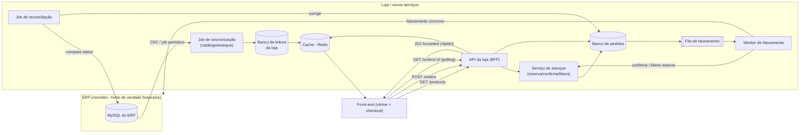

# Diagrama — Arquitetura alvo incremental

Diagrama de referência para a resposta da Pergunta 2. Renderiza automaticamente
no GitHub (blocos ```mermaid).



**Leitura do fluxo:**
1. O catálogo é sincronizado do ERP para o banco de leitura da loja de forma
   assíncrona (não bloqueia nenhuma requisição de cliente).
2. A vitrine só fala com a API da loja, que serve dados via cache/banco
   próprio — nunca o ERP diretamente.
3. O checkout reserva estoque localmente (atômico), responde rápido ao
   cliente e delega o faturamento real ao ERP via fila/worker.
4. O front-end consulta o status do pedido até ele ser confirmado.
5. Um job de reconciliação garante que divergências entre loja e ERP sejam
   detectadas e corrigidas.

No mini-projeto entregue, a versão "mínima" desse desenho está implementada:
sem fila/worker separados (o processamento assíncrono acontece dentro do
próprio processo da API, com timeout), e sem banco de leitura próprio (o
catálogo já está em memória na loja, já que não há um ERP real para
sincronizar). A estrutura de reserva/confirmação/liberação de estoque e o
padrão de resposta rápida + polling, porém, são os mesmos que essa
arquitetura alvo propõe.
